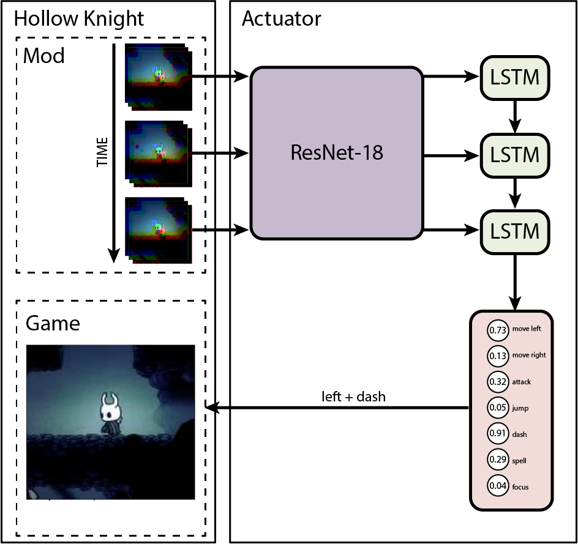

## About The Project

  

This project is a one-week challenge to develop an AI agent capable of playing Hollow Knight. Inspired by [OpenAI's Video Pre-Training model](https://github.com/openai/Video-Pre-Training), the goal was to create an AI that could defeat the Hornet battle without using any charms, focusing on core combat mechanics. The AI was trained using supervised learning, with gameplay data captured through a custom mod. A video that explains the process is available [here](https://youtu.be/A8AkX0GWjVQ).

### Architecture

## Agent Model Zoo

Below are the model weights files for pre-trained and fine-tuned models

* [:arrow_down: Pre-Trained](https://github.com/FernandoLomazzi/Hollow-Knight-AI/raw/refs/heads/main/model/modelR5_hidden_size=256,%20num_layers=2,%20num_classes=7,%20learning_rate=0.001,%20weight_decay=0.0,%20lstm_dropout=0.2,%20bi=False.pt)
* [:arrow_down: Fine-Tuned](https://github.com/FernandoLomazzi/Hollow-Knight-AI/raw/refs/heads/main/model/modelR5-FT_hidden_size=256,%20num_layers=2,%20num_classes=7,%20learning_rate=0.001,%20weight_decay=0.0,%20lstm_dropout=0.2,%20bi=False.pt)

## Prerequisites

* Install requirements: `pip install -r requirements.txt`
* Ensure your screen refresh rate is set to 60 Hz
* Set the in-game action keys:
   * Move Left: `Left Arrow`
   * Move Right: `Right Arrow`
   * Jump: `Z`
   * Attack: `X`
   * Dash: `C`
   * Quick Spell: `D`
   * Focus: `Space`

## Usage

* Get the latest release [here](https://github.com/FernandoLomazzi/Hollow-Knight-AI/releases/latest).
* Unzip and copy the folder path into the `config.ini` file located in `My_Agent_Hollow_Knight_Mod/`
* If you don’t have any Hollow Knight mod installed, download one from [Scarab](https://github.com/fifty-six/Scarab) to enable the modding API.
* Copy the `My_Agent_Hollow_Knight_Mod` folder into `PATH\TO\Hollow Knight\hollow_knight_Data\Managed\Mods`.
* Open Hollow Knight, upload a gamefile, go to the Hornet battle in GodHome, and start the battle.
* Press the `o` key to make the agent start/end playing

## License

Distributed under the GPL-3.0 license See `LICENSE.md` for more information.

## Author

Fernando Sebastián Lomazzi
